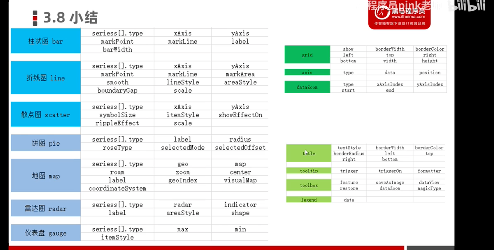
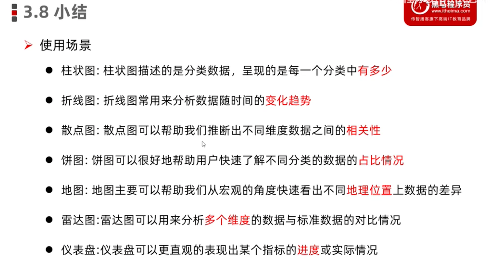

# ECharts

通用配置

- title：图标标题

  - textStyle

  - 标题边框

    borderWidth，borderColor，borderRadius

  - 标题位置

    left、top、right、bottom

- tooltip：提示
  - 触发类型：trigger：'item'
  - 触发时机：triggerOn
- toolbox：工具按钮
  - dataZoom
  - dataView
  - saveAsImage
  - magicType
  - restore
- Legend:图例
  - data:['','']

常用图

- bar 柱状图

- line 折线图

  - 标记：最大值 最小值 平均值 标注区间

    markPoint、markLine、markArea

  - 线条控制：平滑 风格

  - 填充风格

  - 紧挨边缘

  - 缩放：脱离0值比列

    scale:true

  - 堆叠图

- Scatter 散点图

  - 数据类型：二位数组

  - 气泡图效果

    symbolSize：20

    symbolSize：function(arg){

    ​		return 40

    }

    itemStyle:{} 散点颜色

  - 涟漪动画效果

    type：effectScatter

    showEffectOn:''.//render emphasis

    rippleEffect:{scale:10}

### 直角坐标系中的常用配置项

- grid 网格
- axis 坐标轴
- dataZoom 区域缩放
  - Slider:滑块
  - inside:内置

------------------------

pie饼图

- 数据类型 数组对象[name:'',value:'']

- 圆环

  radius: ['35%','45%'],

- 南丁格尔图

  ​    roseType:'radius'

  ​     selectedMode:'multiple' |'single'

  ​	 selectedOffset:30 # 设置选择的偏移量

map地图

- 实现方式
  - 百度地图API
    - 需要申请百度地图ak
  - 矢量地图
- 数据类型
  - Geo json
  - 

- radar雷达图
- gauge 仪表盘

## Echarts全局对象的常用方法

- init
- registerTheme
- registerMap
-  connect //对多个图标进行关联
  - 保存图片的自动拼接
  - 刷新按钮
  - 重置按钮

echartsInstance对象

- setOption
- resize
- on\off
- dispatchAction
- Clear //清除图表
- dispose //销毁图例