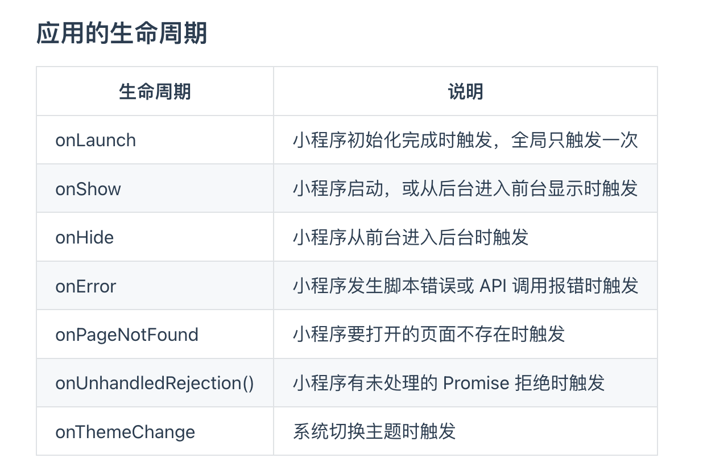

# 微信小程序


### swiper

### Swiper-item


### text

### rich-text

### navigator

- url

- Open-type

  - SwitchTab
  - navigator
  - navigateBack 后退导航

  ##### 编程式导航

  `wx.switchTab`

  `ws.navigateTo({url:"/pages/info/info"})`

  `wx.naviagteBack({delta:1})`

### button

​	type 

​		warm

​		primary

​	size

​		mini

### image

​		属性

- mode		

## 小程序API

- 事件监听API
- 同步API
- 异步API


{{}}


## 事件绑定

tap 手指触摸后离开的事件

input 文本输入框事件

change

`wx-if`

`wx-elif`

`wx-else`

<block> 相当于Vue中的<template>

`hiden="{{true}}"` 切换样式

`wx-for`

`wx-for-index`

`wx-for-item`

`wx-key`


```js
  "enablePullDownRefresh": true //开启下拉刷新
    "backgroundColor": "#bfa",//下拉刷新背景颜色
"backgroundTextStyle":"dark",//下拉loading颜色
      "onReachBottomDistance": 50//设置上拉触底的距离
```


list

## 小程序生命周期




### Vant

### mobx

​	mobx-miniprogram

​	mobs-minipargram-bingdings

安装

`npm install --save mobx-miniprogram@4.13.2 mobx-miniprogram-bindings@1.2.1 `

Step1  新建文件/store/store.js

```js
import { observable, action} from "mobx-miniprogram"
export const store = observable({
  numA:1,
  numB:4,

  get sum(){
    return this.numA+this.numB;
  },
  updateNumA:action(function(step){
    this.numA += step
  }),
  updateNumB:action(function(step){
    this.numB += step
  })
})
```

在页面中使用mobx

```javascript
import {createStoreBindings} from 'mobx-miniprogram-bindings'
import {store} from '../../store/store'

Page({
   /**
   * 生命周期函数--监听页面加载
   */
  onLoad(options) {
      this.storeBindings = createStoreBindings(this,{
        store,
        fields:['numA','numB','sum'],
        actions:['updateNumA']
      })
  },
  /**
   * 生命周期函数--监听页面卸载
   */
  onUnload() {
    this.storeBindings.destroyStoreBindings()
  },
})
```

在组件中使用mobx

```
// custom-tab-bar/index.js
import {createStoreBindings} from 'mobx-miniprogram-bindings'
import {store} from '../store/store'
Component({
  lifetimes:{
    attached(){
      this.storeBindings = createStoreBindings(this,{
        store,
        fields:['sum','active'],
        actions:['changeActive']
      })
    }
  }
})
```

## 分包

`"subpackage"

##### 打包原则

1. 小程序会按subpackges的配置进行分包，subpackages之外的目录将被打包到主包中
2. 主包也可以有自己的pages（即最外层的pages字段）
3. tabBar页面必须在主包内
4. 分包之间不能互相嵌套

##### 引用原则

1. 主包无法引用分包内的私有资源
2. 分包之间不能相互引用私有资源
3. 分包可以引用主包内的公共资源


### 独立分包

**独立于主包和分包单独运行**

`"independent":true`

**独立分包和普通分包以及主包之间，是相互隔绝的，不能相互引用彼此的资源！**

独立分包不能引用主包中的公共资源

## 分包预下载

```javascript
  "preloadRule": {
    "pages/login/login":{
      "network": "all",
      "packages": [
        "p1",
        "p2"
      ]
    }
  },
```

