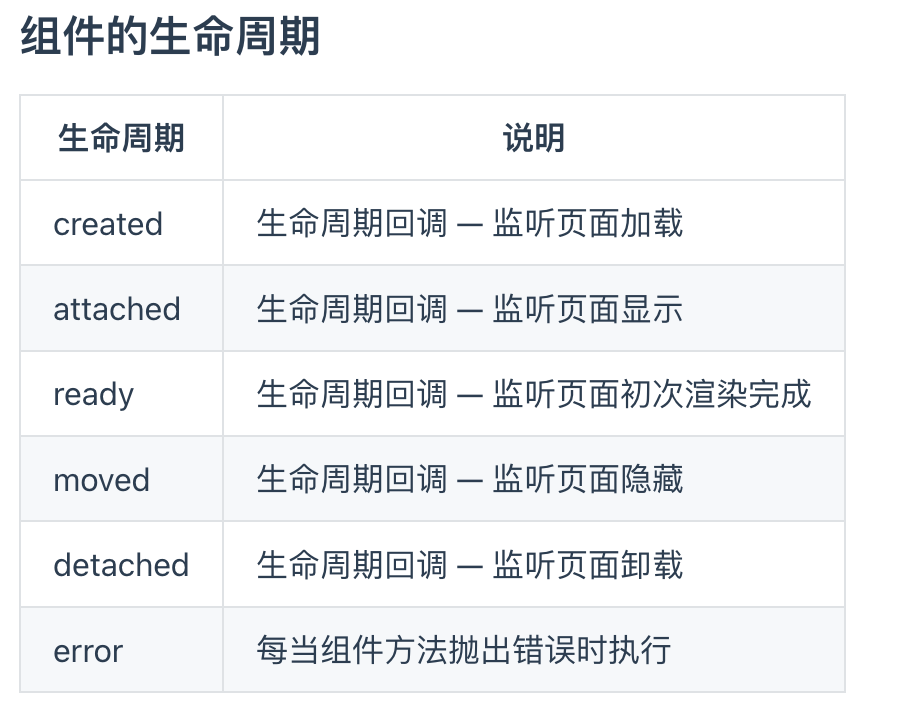

# 微信小程序


### swiper

### Swiper-item


### text

### rich-text

### navigator

- url

- Open-type

  - SwitchTab
  - navigator
  - navigateBack 后退导航

  ##### 编程式导航

  `wx.switchTab`

  `ws.navigateTo({url:"/pages/info/info"})`

  `wx.naviagteBack({delta:1})`

### button

​	type 

​		warm

​		primary

​	size

​		mini

### image

​		属性

- mode		

## 小程序API

- 事件监听API
- 同步API
- 异步API


{{}}


## 事件绑定

tap 手指触摸后离开的事件

input 文本输入框事件

change

`wx-if`

`wx-elif`

`wx-else`

<block> 相当于Vue中的<template>

`hiden="{{true}}"` 切换样式

`wx-for`

`wx-for-index`

`wx-for-item`

`wx-key`


```js
  "enablePullDownRefresh": true //开启下拉刷新
    "backgroundColor": "#bfa",//下拉刷新背景颜色
"backgroundTextStyle":"dark",//下拉loading颜色
      "onReachBottomDistance": 50//设置上拉触底的距离
```


list

## 小程序生命周期



