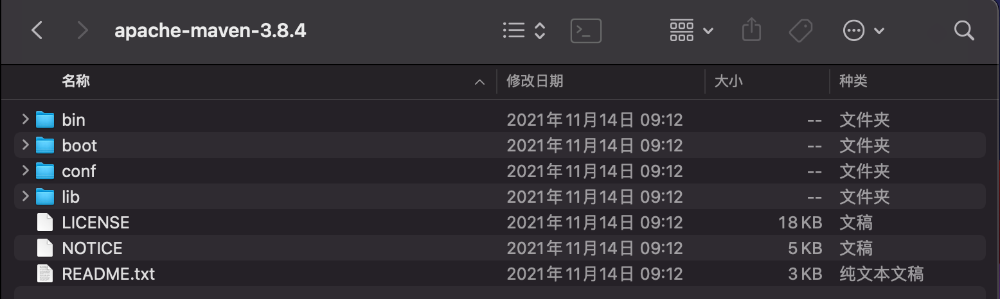

Maven

项目架构管理工具

用来管理整个项目，方便导入jar包

Maven的核心思想：**约定大于配置**

​	有约束，不要去违反。

Maven会规定好你该如何去编写我们的java代码，必须要按照这个规范来；


官网：https://maven.apache.org/

Mac 电脑安装Maven

- brew search maven
- brew info maven
- brew install maven


 在路径 /usr/local/Cellar/maven/3.5.0/libexec/conf 下找到 setting.xml，设置
 <localRepository>/Users/xxx/maven_repo</localRepository>

下载安装包 后解压得到一下文件




### 配置环境变量

- M2_HOME	Maven的目录  //避免集成开发环境报错
- MAVEN_HOME	maven的目录
- 在系统的path中配置%MAVEN_HOME%\bin

### 配置代理

- 镜像：mirrors

  - Maven阿里云镜像

    打开 Maven 的配置文件 (windows 机器一般在 maven 安装目录的 conf/settings.xml)，在 `<mirrors></mirrors>` 标签中添加 mirror 子节点:

```xml
<mirror>
    <id>aliyunmaven</id>
    <mirrorOf>*</mirrorOf>
    <name>阿里云公共仓库</name>
    <url>https://maven.aliyun.com/repository/public</url>
</mirror>
```

### 本地仓库

创建本地maven 仓库文件夹

​	mkdir maven-repo

配置文件加入

```xml
  <localRepository>/Volumes/working/Environment/apache-maven-3.8.4/maven-repo</localRepository>
```

## IDEA配置Maven


## Maven核心配置文件

```xml
<?xml version="1.0" encoding="UTF-8"?>
<project xmlns="http://maven.apache.org/POM/4.0.0"
         xmlns:xsi="http://www.w3.org/2001/XMLSchema-instance"
         xsi:schemaLocation="http://maven.apache.org/POM/4.0.0 https://maven.apache.org/xsd/maven-4.0.0.xsd">
    <modelVersion>4.0.0</modelVersion>

    <groupId>com.itinglight</groupId>
    <artifactId>MavenTest02</artifactId>
    <version>1.0-SNAPSHOT</version>
    <name>MavenTest02</name>
    <packaging>war</packaging>
    <!--配置-->
    <properties>
        <project.build.sourceEncoding>UTF-8</project.build.sourceEncoding>
        <maven.compiler.target>1.8</maven.compiler.target>
        <maven.compiler.source>1.8</maven.compiler.source>
        <junit.version>5.8.1</junit.version>
    </properties>
    <!--项目依赖-->
    <dependencies>
        <dependency>
            <groupId>javax.servlet</groupId>
            <artifactId>javax.servlet-api</artifactId>
            <version>4.0.1</version>
            <scope>provided</scope>
        </dependency>
        <dependency>
            <groupId>org.junit.jupiter</groupId>
            <artifactId>junit-jupiter-api</artifactId>
            <version>${junit.version}</version>
            <scope>test</scope>
        </dependency>
        <dependency>
            <groupId>org.junit.jupiter</groupId>
            <artifactId>junit-jupiter-engine</artifactId>
            <version>${junit.version}</version>
            <scope>test</scope>
        </dependency>
    </dependencies>

    <build>
        <plugins>
            <plugin>
                <groupId>org.apache.maven.plugins</groupId>
                <artifactId>maven-war-plugin</artifactId>
                <version>3.3.2</version>
            </plugin>
        </plugins>
        <!-- 在build中构建resources，来防止我们资源导出失败的问题-->
        <resources>
            <resource>
                <directory>src/main/resources</directory>
                <excludes>
                    <exclude>**/*.properties</exclude>
                    <exclude>**/*.xml</exclude>
                </excludes>
                <filtering>false</filtering>
            </resource>
        </resources>
    </build>
</project>
```

## Maven官方仓库地址 https://mvnrepository.com/