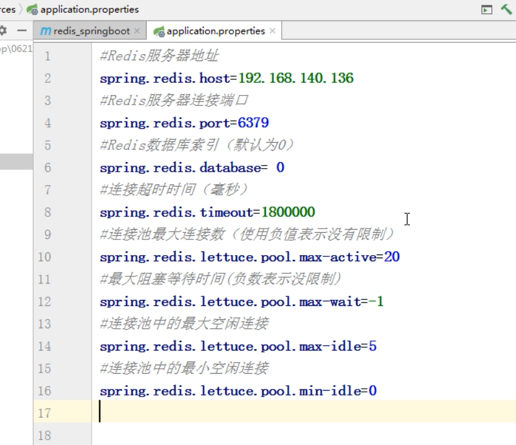

# Redis

Redis-cli

```
info Server
```

五大基本类型

1. String
2. List 【底层**双向链表**】
3. Set（集合）【哈希表实现的字典】
4. Hash哈希
5. Zset有序集合【‘跳跃表】

```shell
select 1
keys * #查看当前库的所有key
exists key #判断某个key是否存在
type key #判断key的类型
dek key
unlink key 
expire key 10 #设置key10秒后过期
ttl key #查看key的过期时间
dbsize #查看当前库的key数量
flushdb #清空当前库
dlushall #清空全部库


###String常用命令
set #设置key的值
get #获取key的值
append #追加
strlen #获取key value的长度
setnx # 不存在时设置key
setex #设置key的同时设置过期时间
incr key#当value为数字时 +1
decr key #当value为数字时 -1
incrby key <步长> #当value为数字时 增加指定数量
decrby key <步长> #当value为数字时 增加减少数量

mset #设置多个key value
mget #获取多个key的值
msetnx #设置多个不存在的key value
getrange #getrange key 0 3 
setrangee name 3 abc #设置第几位开始为abc
setex <key><过期时间><value>
getset key newValue #获取旧值设置新值

###列表常用命令
lpush k1 v1 v2 v3 #从左边放
lrange k1 0 3
rpush k2 v1 v2 v3#从右边放
lpop k1 #从左边取
rpop k1 #从右边取
rpoplpush k1 k2#将右边的值取出来放到左边
lindex key index #根据index获取value
llen key #获取列表的长度
linsert key before|after <value> <newValue> #在value之前新增一个值
lrem<key><n><value>从左边删除n个value（从左到右）
lset<key><index><value>将列表key下标为index的值替换成value

###Set常用命令
sadd k1 v1 v2 v3 
smembers k1
sismembers k1 v1
scard  #返回该集合元素的个数
spop #随机从该集合中吐出一个值
srandmember #随机从该集合中取出n个值，不会从集合中删除
smove #把集中中的一个值移动到另一个集合。
sinter #返回两个集合中的交集元素
sunion #返回两个集合中的并集元素
sdiff #返回两个集合中的差集元素

###Hash常用命令
hset
hget
hmset
hmget
hkeys
hvals
hincrby
hsetnx

###ZSet常用命令
zadd topn 200 java 300 c++ 400 mysql 500Php
zrangebyscore topn 300 500
zrevrangebyscore k
zincrby 
zrem
zcount
zrank

```

## 配置文件

下载地址：http://download.redis.io/redis-stable/redis.conf

## 发布和订阅

Subscribe channel1

publish channel1 hello


## Bitmaps

```
setbit key offset value
getbit 
bitcount #统计值为1的操作
bitop #bitop and
```

可以用来统计日活量

## HyperLogLog

```shell
pfadd 
pfcount # 统计基数大数量
pfmerge #合并两个key的值
```

## Gepgraphic 地理信息

```shell
#geoadd key [NX|XX] [CH] longitude latitude member [longitude latitude member ...]
#geoadd china:city 1o6.50 29.53 chongqing 
geoadd
geopos
geodist #取两个位置之间的直线距离
georadius china:city 104 28 1000 km #查询地点指定范围内的城市
```

## jedis

需要修改配置文件中的

bind 127.0.0.1 注释掉

protcted-mode yes 改为no

关闭防火墙

`systemctl status firewalld` 查看防火墙状态

`systemctl  stop firewalld` 关闭防火墙

```java
//创建Jedis对象
Jedis jedis = new Jedis("127.0.0.1",6379);
```

## SpringBoot整合Redis

导入依赖

```xml
		<!-- https://mvnrepository.com/artifact/org.springframework.boot/spring-boot-starter-data-redis -->
		<dependency>
			<groupId>org.springframework.boot</groupId>
			<artifactId>spring-boot-starter-data-redis</artifactId>
			<version>2.6.2</version>
		</dependency>
		<!-- https://mvnrepository.com/artifact/org.apache.commons/commons-pool2 -->
		<dependency>
			<groupId>org.apache.commons</groupId>
			<artifactId>commons-pool2</artifactId>
			<version>2.11.1</version>
		</dependency>
```

配置redis



## 事务

multi 

```
multi #开启事物
discard #取消事物
exec #执行事务
```

悲观锁

乐观锁（Optimistic Lock）

```shell
watch key #监视
multi


exec
```

## ab实现并发测试

centos `yum install https-tools`

`ab -n 10220 -c 10 http://localhost:8080/test`

-n 发送请求数量

-c 并发请求数

### 使用链接池解决超时问题

### Lua脚本解决库存遗留问题

```java
jedis.evalsha() //执行lua脚本
```

## 持久化操作

RDB 

配置文件中rdbchecksum的作用#检查数据有效性 默认为yes

```
save #备份
bgsave #后台备份
```

